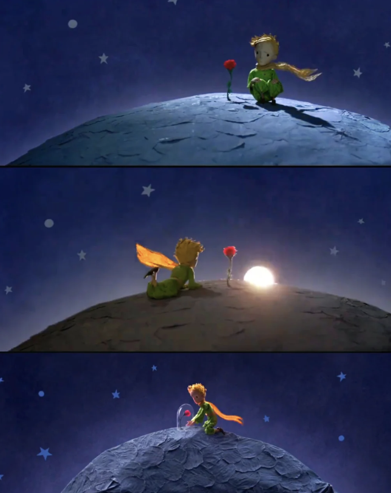

# Qiuzhi-Wang_qwan6944_IDEA9103_tut6

## **Individual Task**

**1. Instructions for interacting with the code works**
   
When clicking anywhere on the canvas, a new circle is generated. The diameter and colour of this circle are random. The circle will use Perlin noise to develop a slight random motion, adding to the dynamic effect.

The interactive function implements the mousePressed functionality, which is called on mouse click and generates a new circle object.

**2. Detailed information about animation processing**

- Using **Perlin** noise to drive animation
Perlin noise is used to drive the motion of the circle to achieve smooth and natural animation. 

- Animation properties
  
a.Circle motion: The circle's x and y coordinates are slightly adjusted based on the Perlin noise to make it move smoothly on the canvas.

b.Background texture: Perlin noise is also used for the background's dot-matrix effect, making the background appear more dynamic and deeper.

c.Changes different colour

- Animation Inspiration
Inspired by the book “The Little Prince”, the main image depicts the rose. When the canvas is clicked multiple times, the random fluttering of the circles and the dynamic texture of the background mimic the effect of the starry sky in the book.



- Technical explanation and Reference Notes
  
a.When the canvas is clicked, a new circle is generated. During this process, I use the ```mousePressed()``` function. To make the motion of the circle smoother, I use Perlin noise to create two noise offsets that control the changes in the x and y coordinates of the circle, respectively, and ```noiseOffsetX``` for random offsets of the X-axis noise.

b. Color change: Changed all colors in the code. When a new circle is generated, two random color values are assigned to each circle, and the corresponding color is filled in when drawing, so that the top and bottom half of each circle appear different colors.

c.Background texture:Use ```generateBackgroundTexture()```,Perlin noise to generate a matrix of dots that change slightly over time to make the background texture appear more vivid.

d.Window resized: Added a ```windowresized()```function to resize the canvas when the browser window is resized.

[mousePressed()](https://p5js.org/reference/#/p5/mousePressed)
[windowresized()](https://p5js.org/reference/#/p5/windowResized)
[push()](https://p5js.org/reference/#/p5/push)